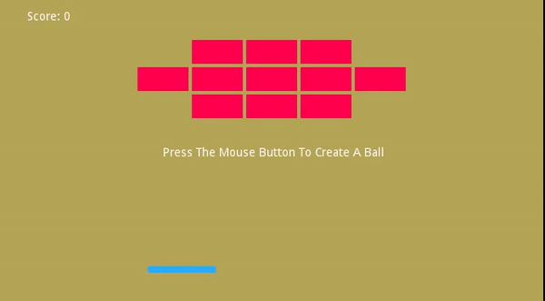

# GoDot Engine Bricks Game

## Live Demo

<a href="https://rasjonell.github.io/GoDot-Bricks/build/index.html" target="_blank">Run The Game!</a>

## Run Manually

clone the repo

```
cd build/
```

then open up index.html with ```--allow-file-access-from-files``` argument.

For Chromium run:

```
chromium index.html --allow-file-access-from-files 
```

Similarly, For Firefox:

```
firefox index.html --allow-file-access-from-files 
```



